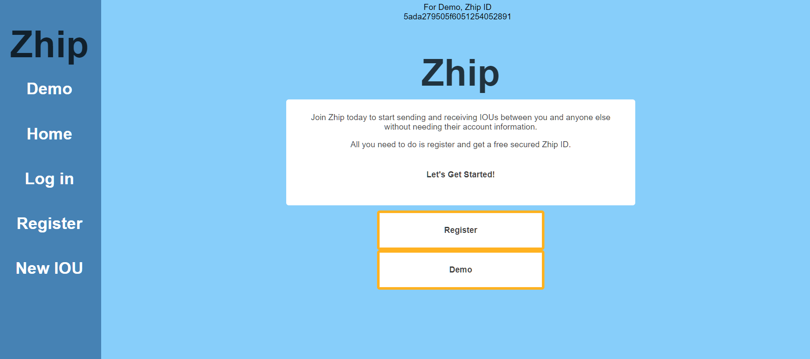
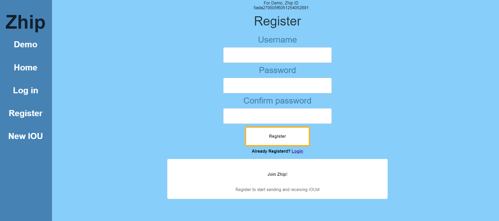
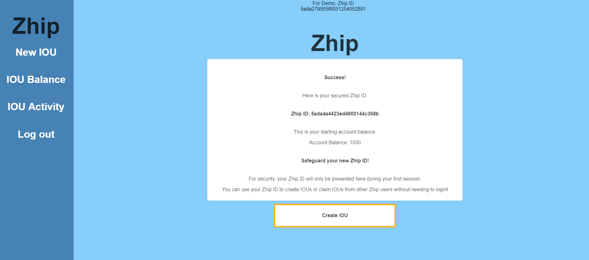
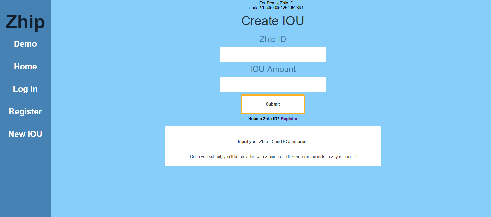
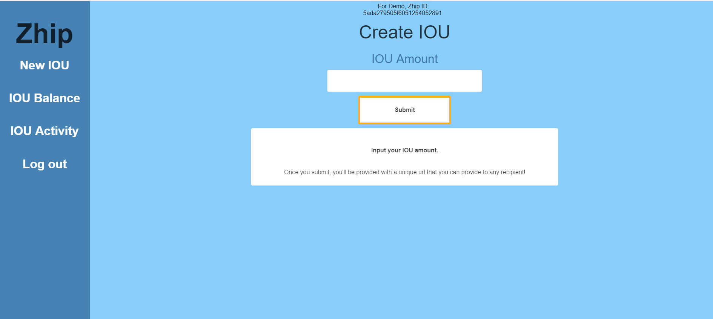
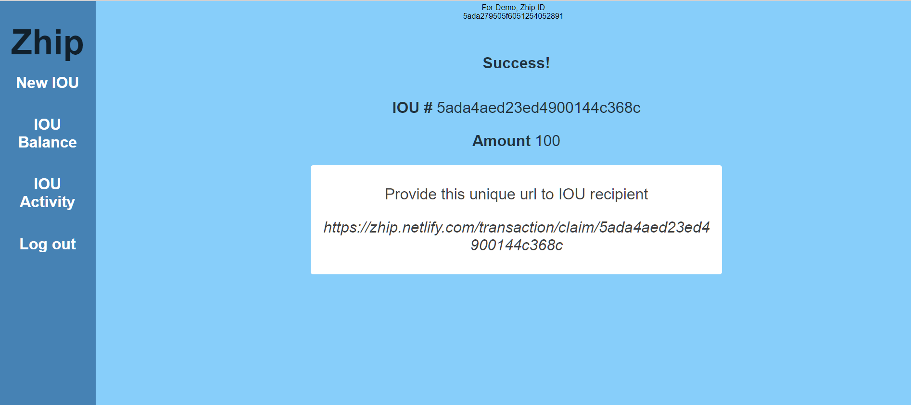
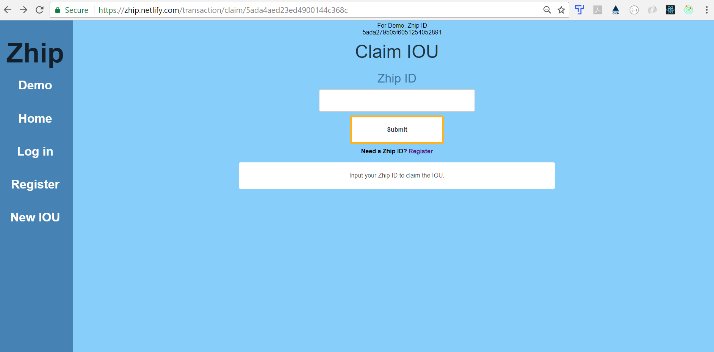
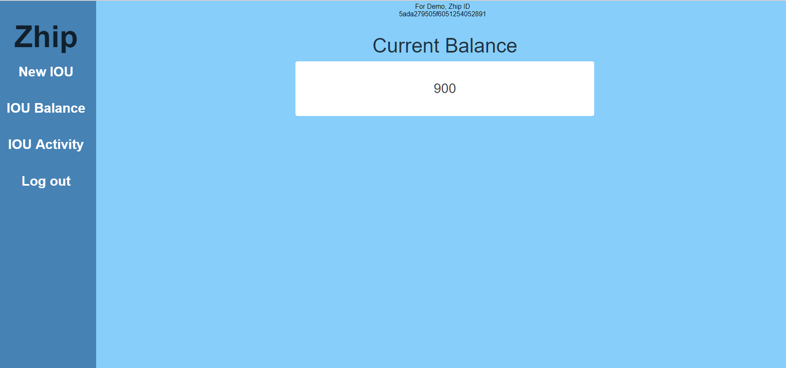
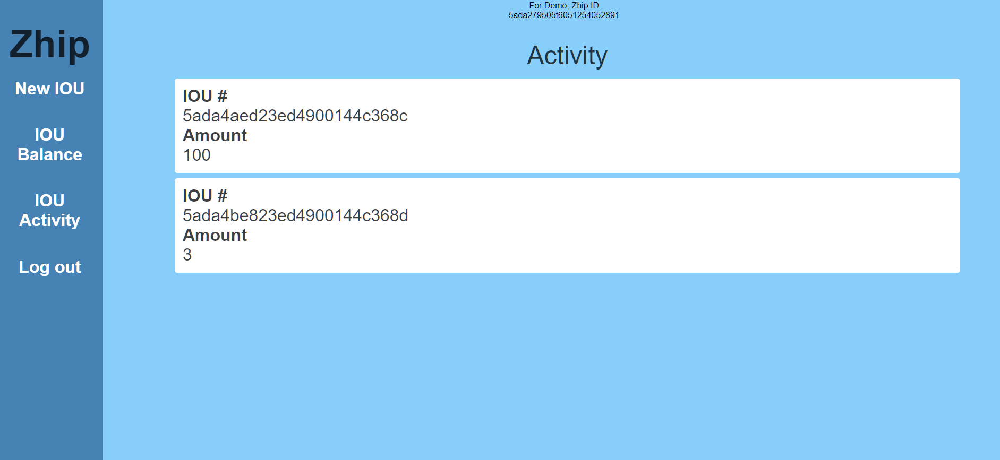
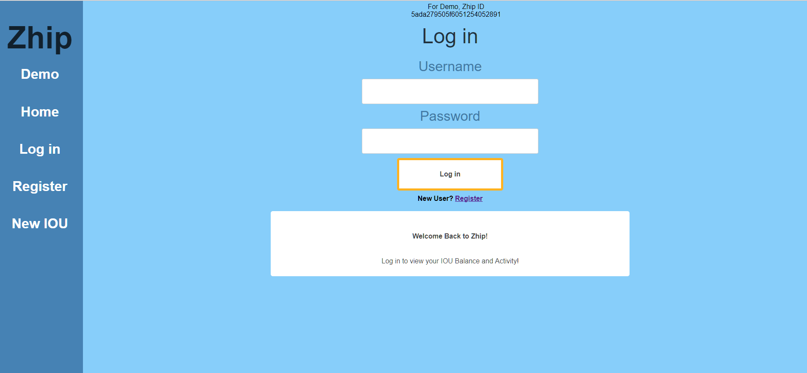

<h1 align="center">
  <br>
  Zhip
  <br>
</h1>

<h4 align="center">Exchange IOUs with anyone else using a generated URL link.</h4>
<h4 align="center">https://zhip.netlify.com/home</h4>

<p align="center">
    <a href="#key-features">Key Features</a> •
    <a href="#setup">Setup</a> •
    <a href="#usage">Usage</a> •
    <a href="#screenshots">Screenshots</a> •
    <a href="#documentation">Documentation</a> •
    <a href="#history">History</a> •
    <a href="#technology-stack-credits">Technology Stack Credits</a> •
</p>

---
Zhip is a web application to send and receive IOUs between individuals reliably and securely using a generated URL link.



---
## Key Features
+ Register a secured Zhip account
+ Receive a secured Zhip ID
+ Create IOUs 
    - using a secured Zhip ID
    - without using a secured Zhip ID (access through user account)
+ Obtain a securely generated unique URL link
    - Can be given to any individual, anonymously
+ Claim IOUs
    - using a secured Zhip ID
+ Check IOU balance
    - access through user account 
+ Check IOU activity
    - access through user account
+ Access registered Zhip account
---

## Setup

To clone and run this application, you'll need [Git](https://git-scm.com), [Node.js](https://nodejs.org/en/download/) (which comes with [npm](http://npmjs.com)), [MongoDB](https://www.mongodb.com/download-center#atlas) installed on your computer. 

From your command line:

```bash
# In seperate terminals, clone these repository
$ git clone https://github.com/lindafoodev/zhip-app-client.git
$ git clone https://github.com/lindafoodev/zhip-app-server.git

# In seperate terminals, go into the repositories
$ cd zhip-app-client
$ cd zhip-app-server

# Install dependencies
$ npm install

# In server repository, run mongod instance on localhost (Seperate Terminal)
$ mongod

# In both repositories, run the app
$ npm start
```
---
## Usage
After you clone this repo to your desktop, go to its root directory and run npm install to install its dependencies.

Once the dependencies are installed, run an instance of mongod. Then, you can run npm start to start the application. You will be able to access the server at localhost:8080 and the client at localhost:3000

---
## Screenshots
<h3 align="center">
  <br>
  Register a Zhip Account
  <br>
</h3>



<h3 align="center">
  <br>
  Receive Secured Zhip ID
  <br>
</h3>



<h3 align="center">
  <br>
  Create IOU - w/Zhip ID
  <br>
</h3>



<h3 align="center">
  <br>
  Create IOU - w/Zhip account
  <br>
</h3>



<h3 align="center">
  <br>
  Obtain generated URL link for IOU 
  <br>
</h3>



<h3 align="center">
  <br>
  Claim IOU
  <br>
</h3>



<h3 align="center">
  <br>
  Check IOU Balance
  <br>
</h3>



<h3 align="center">
  <br>
  Check IOU Activity
  <br>
</h3>



<h3 align="center">
  <br>
  Access Registered Zhip Account
  <br>
</h3>



---
## Documentation
#### Model

* `user` The User object models the users in the Users database for REST API.
  * `username` {string} Unique username provided by user on account registration
  * `password` {string} Unique password provided by user on account registration, hashed
  * `accountBalance` {number} IOU balance for User, user initially given 1000 IOUs to start
  * `isFirstTimeUser` {boolean} Used to track if user is accessing Zhip for the first time or not. Enhanced security, to determine whether Zhip ID is shown to user or not.

* `transaction` The Transaction object models the transactions in the Transactions database for REST API.  
  * `userIdInitiator` {string} Capture the user who created the IOU
  * `userIdClaimor` {string} Capture the user who claims the IOU
  * `transactionAmount` {number} Designate the IOU amount
  * `isIOUClaimed` {boolean} Designate whether the IOU has been claimed yet

#### REST API - Server

* Auth Router:
  * POST - /api/auth/login
      Creates and returns a 'local' authorization token
      Protected: Yes
  * POST -/api/auth/refresh
      Creates and returns a refreshed 'jwt' authorization token
      Protected: Yes

* User Router:
  * POST - /api/users
      Creates and returns a new user through application registration
      Protected: No

  * PUT - /api/users/return
      Updates user to note user's first time accessing application 
      Protected: Yes

* v1 Router:
  * POST - /api/v1/transaction/create
      Creates a new transaction and returns the new IOU created, user not logged in
      Protected: No

  * POST - /api/v1/transaction/initiate
      Creates a new transaction and returns the new IOU created, user logged in
      Protected: Yes

  * PUT - /api/v1/account/send
      Updates user account to note IOU created
      Protected: No

  * PUT - /api/v1/transaction/claim/:transactionId
      Updates transaction to note that IOU is claimed 
      Protected: No

  * PUT - /api/v1/account/claim/:transactionId
      Updates user account to note IOU claimed 
      Protected: No

  * GET - /api/v1/activity
      Retrieves and provides user IOU activity 
      Protected: Yes

  * GET - /api/v1/balance
      Retrieves and provides user IOU balance 
      Protected: Yes

#### Components - Client
  * App
  * LandingPage
  * Dashboard
  * RegistrationPage
  * LoginPage
  * CreateForm
  * CreateTransactionContainer
  * InitiateForm
  * InitiateTransactionContainer
  * ClaimForm
  * ClaimTransactionContainer
  * BalanceContainer
  * ActivityContainer
  * LogOut
  * DemoTag
  * Sidebar
  * HamburgerNav

---
## History
* Client| Server
* 2.1.0 | 2.1.0 - Update README
* 2.0.1 - Add default navigation component height for styling
* 2.0.0 | 2.0.0 - Add authentication and login functionality
* 1.0.0 | 1.0.0 - Initial release

---
## Technology Stack Credits
This software uses code from several open source packages.

Front-end technologies
+ ES6 JavaScript
+ React/Redux
+ CSS media queries

Server technologies
+ [Express](http://expressjs.com/)
+ [bcryptjs](https://www.npmjs.com/package/bcryptjs)
+ [jsonwebtoken](https://jwt.io/)
+ [passport.js](http://www.passportjs.org/)

Data Persistence
+ [MongoDB](https://www.mongodb.com/)
+ [Mongoose](http://mongoosejs.com/)

​Hosting/SaaS
+ [Heroku](https://dashboard.heroku.com/)
+ [MLab](https://mlab.com/)

Development Environment
+ Continuous Deployment
    - [Netlify](https://netlify.com/) / [Heroku](https://dashboard.heroku.com/)
+ [Github](https://github.com/) (branching, pull requests, merging)
+ [VS Code](https://code.visualstudio.com/)
+ [Node.js](https://nodejs.org/) Libraries
    - [Nodemon](https://nodemon.io/)
    - [dotenv](https://www.npmjs.com/package/dotenv)

---
